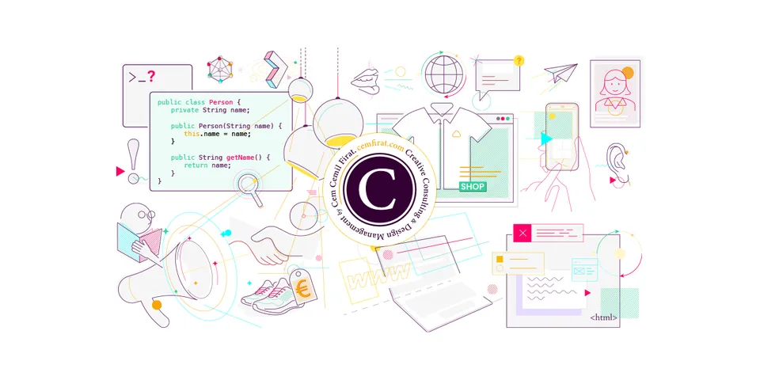

<p align="center">
  
</p>

<h1 align="center">Repository Governance</h1>

<p align="center">
  Reusable GitHub ruleset templates and a small GitHub CLI helper for protecting a repository's <code>main</code> branch.
</p>

The policy is intentionally split into two rulesets:

- **Hard guardrails** protect `main` from deletion and force-pushes with **no bypass actors**.
- **Merge gates** require pull requests and can optionally require repository-specific CI checks. The built-in `Maintain` and `Repository admin` roles may bypass these merge gates.

Keeping destructive protections separate from merge bypasses prevents an emergency merge bypass from also allowing deletion or force-pushes on `main`.

## Repository layout

- `rulesets/main-protection-hard-guardrails.json`  
  Non-bypassable deletion and force-push protection for `main`.

- `rulesets/main-protection-merge-gates-base.json`  
  Pull-request gate for `main`. Repository-specific required status checks are intentionally omitted from the base template.

- `scripts/apply-rulesets.sh`  
  Applies both templates with the GitHub CLI and can add required status checks at creation time.

- `.github/workflows/validate.yml`  
  Validates the templates and helper script on pull requests and pushes to `main`.

## Requirements

- Bash
- `jq`
- GitHub CLI (`gh`) for live changes
- A GitHub account and repository plan that supports the rules you intend to use
- An existing `main` branch in the target repository

Authenticate the GitHub CLI before making live changes:

```bash
gh auth login
```

If you want to make CI checks required, run CI at least once in the target repository so the check names are known.

## Usage

Preview the payloads without contacting GitHub:

```bash
bash scripts/apply-rulesets.sh OWNER/REPO --dry-run
```

Create the two base rulesets:

```bash
bash scripts/apply-rulesets.sh OWNER/REPO
```

Create them and require one or more status checks:

```bash
bash scripts/apply-rulesets.sh OWNER/REPO \
  --check "Build, typecheck and test" \
  --check "Smoke test"
```

Also require all pull-request conversations to be resolved:

```bash
bash scripts/apply-rulesets.sh OWNER/REPO \
  --require-conversation-resolution \
  --check "CI"
```

The helper refuses to continue when either standard ruleset name already exists, so it does not silently create duplicates.

## Policy details

### `main protection - hard guardrails`

- targets only `refs/heads/main`
- blocks branch deletion
- blocks non-fast-forward updates / force-pushes
- contains no bypass actors

### `main protection - merge gates`

- targets only `refs/heads/main`
- requires a pull request
- allows `Maintain` to bypass the merge gate
- allows `Repository admin` to bypass the merge gate
- contains no deletion or force-push rule
- can include repository-specific required status checks
- requires the branch to be up to date when status checks are supplied

The base template uses **0 required approvals**. It requires the pull-request path, but not an independent reviewer approval. Adjust that policy if your repository needs mandatory review.

Conversation resolution is off in the base template and can be enabled with `--require-conversation-resolution`.

## Safety

The helper performs preflight checks before writing rulesets and attempts to roll back the hard-guardrail ruleset if creation of the merge-gate ruleset fails.

Always review the generated payload with `--dry-run` before applying it to a repository you do not control.

Do not store tokens, credentials, private keys, customer data, or internal-only operational details in this repository.

## Contributing

Small, focused pull requests are welcome. See [CONTRIBUTING.md](CONTRIBUTING.md).

## License

Licensed under the [MIT License](LICENSE).
